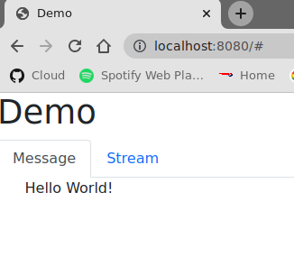
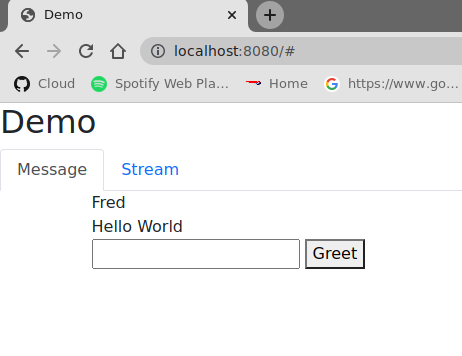
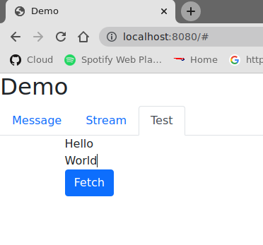
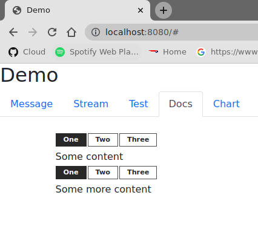

:toc: auto

These samples explore the different options that Spring Boot developers have for using Javascript and CSS on the client (browser) side of their application. Part of the plan is to explore some Javascript libraries that play well in the traditional server-side-rendered world of Spring web applications. Those libraries tend to have a light touch for the application developer, in the sense that they allow you to completely avoid Javascript, but still have nice a progressive "modern" UI. We also look at some more "pure" Javascript tools and frameworks. It's kind of a spectrum, so as a TL;DR here is a list of the sample apps, in rough order of low to high Javascript content:

* `htmx`: https://htmx.org[HTMX] is a library that allows you to access modern browser features directly from HTML, rather than using javascript. It is very easy to use and well suited to server-side rendering because it works by replacing sections of the DOM directly from remote responses. It seems to be well used and appreciated by the https://www.python.org/[Python] community.

* `turbo`: https://turbo.hotwired.dev/[Hotwired] (Turbo and Stimulus). Turbo is a bit like HTMX. It is widely used and supported well in https://rubyonrails.org/[Ruby on Rails]. Stimulus is a lightweight library that can be used to implement tiny bits of logic that prefer to live on the client.

* `vue`: https://vuejs.org[Vue] is also very lightweight and describes itself as "progressive" and "incrementally adoptable". It is versatile in the sense that you can use a very small amount of Javascript to do something nice, or you can push on through and use it as a full-blown framework.

* `react-webjars`: uses the https://reactjs.org[React] framework, but without a Javascript build or bundler. React is nice in that way because, like Vue, it allows you to just use it in a few small areas, without it taking over the whole source tree.

* `nodejs`: like the `turbo` sample but using https://nodejs.org[Node.js] to build and bundle the scripts, instead of https://webjars.org[Webjars]. If you get serious about React, you will probably end up doing this, or something like it. The aim here is to use Maven to drive the build, at least optionally, so that the normal Spring Boot application development process works. Gradle would work the same.

* `react`: is the `react-webjars` sample, but with the Javascript build steps from the `nodejs` sample.

If you want to know more about React and Spring there is a https://spring.io/guides/tutorials/react-and-spring-data-rest/[tutorial on the Spring website]. There is also content on https://angular.io[Angular] via another https://spring.io/guides/tutorials/spring-security-and-angular-js/[tutorial on the Spring website] and the related getting started content https://github.com/dsyer/spring-boot-angular[here].

## Getting Started

All the samples can be built and run with standard Spring Boot processes (e.g. see https://spring.io/guides/gs/spring-boot/[this getting started guide]). The Maven wrapper is in the parent directory so from each sample on the command line you can `../mvnw spring-boot:run` to run the apps or `../mvnw package` to get an executable JAR. E.g.

```
$ cd htmx
$ ../mvnw package
$ java -jar target/js-demo-htmx-0.0.1.jar

  .   ____          _            __ _ _
 /\\ / ___'_ __ _ _(_)_ __  __ _ \ \ \ \
( ( )\___ | '_ | '_| | '_ \/ _` | \ \ \ \
 \\/  ___)| |_)| | | | | || (_| |  ) ) ) )
  '  |____| .__|_| |_|_| |_\__, | / / / /
 =========|_|==============|___/=/_/_/_/
 :: Spring Boot ::            (v2.6.0)

2021-12-08 08:50:30.517  INFO 2385363 --- [           main] com.example.jsdemo.JsDemoApplication     : Starting JsDemoApplication using Java 11.0.7 on tower with PID 2385363 (/home/dsyer/dev/demo/workspace-daily/js-demo/target/classes started by dsyer in /home/dsyer/dev/demo/workspace-daily/js-demo)
2021-12-08 08:50:30.519  INFO 2385363 --- [           main] com.example.jsdemo.JsDemoApplication     : No active profile set, falling back to default profiles: default
2021-12-08 08:50:31.501 DEBUG 2385363 --- [           main] s.w.r.r.m.a.RequestMappingHandlerMapping : 6 mappings in 'requestMappingHandlerMapping'
2021-12-08 08:50:31.519 DEBUG 2385363 --- [           main] o.s.w.r.handler.SimpleUrlHandlerMapping  : Patterns [/webjars/**, /**, /node_modules/**] in 'resourceHandlerMapping'
2021-12-08 08:50:31.641 DEBUG 2385363 --- [           main] o.s.w.r.r.m.a.ControllerMethodResolver   : ControllerAdvice beans: none
2021-12-08 08:50:31.666 DEBUG 2385363 --- [           main] o.s.w.s.adapter.HttpWebHandlerAdapter    : enableLoggingRequestDetails='false': form data and headers will be masked to prevent unsafe logging of potentially sensitive data
2021-12-08 08:50:31.829  INFO 2385363 --- [           main] o.s.b.web.embedded.netty.NettyWebServer  : Netty started on port 8080
2021-12-08 08:50:31.841  INFO 2385363 --- [           main] com.example.jsdemo.JsDemoApplication     : Started JsDemoApplication in 0.97 seconds (JVM running for 1.209)
```

## Narrowing the Choices

Browser application development is a huge landscape of ever-changing options and choices. It would be impossible to present all those options in one coherent picture, so we have intentionally limited the scope of tools and frameworks we look at. We start with a bias of wanting to find something that works with a light touch, or at least incrementally adoptable. There is also the previously mentioned bias towards libraries that work well with server-side renderers - those that deal with fragments and subtrees of HTML. We have used Javascript https://developer.mozilla.org/en-US/docs/Web/JavaScript/Guide/Modules[ESM] wherever possible, since most browsers now support that, but equally most libraries that publish a module to `import` also have an equivalent bundle you can `require`.

Many of the samples use https://webjars.org[Webjars] to deliver the Javascript (and CSS) assets to the client. This is very easy and sensible for an application with a Java backend. Not all the samples use Webjars though, and it wouldn't be hard to convert them to either use a CDN (like https://unpkg.com[unpkg.com] or https://jsdeliver.com[jsdelivr.com]) or a build time Node.js bundler. The samples here that do have a bundler use https://rollupjs.org/guide/en/[Rollup], but you could just as well use https://webpack.js.org/[Webpack], for instance. They also use straight https://www.npmjs.com/[NPM] and not https://classic.yarnpkg.com/[Yarn] or https://gulpjs.com/[Gulp], which are both popular choices and could very well be used instead. All the samples use https://getbootstrap.com/[Bootstrap] for CSS, but other choices are available.

There are also choices that can be made on the server side. We have used https://docs.spring.io/spring-framework/docs/current/reference/html/web-reactive.html#spring-webflux[Spring Webflux] but https://docs.spring.io/spring-framework/docs/current/reference/html/web.html#spring-web[Spring MVC] would work identically. We have used Maven as a build tool, but using Gradle it would be easy to achieve the same goals. All the samples actually have a static home page (not even rendered as a template), but they all have some dynamic content, and we have chosen https://github.com/samskivert/jmustache[JMustache] for that. https://www.thymeleaf.org/[Thymeleaf] (and other templating engines) would work just as well. In fact Thymeleaf has built-in support for fragments and that can be quite useful when you are updating parts of a page dynamically. You could do that same with Mustache (probably) with a bit of work, but we didn't need it in these samples, so there wasn't any point.

## Create a New Application

To get started with Spring Boot and client-side development, let's start at the beginning, with an empty app from https://start.spring.io[Spring Initializr]. You can go to the website and download a project with web dependencies (select Webflux or WebMVC) and open it up in your IDE. To generate a project from the command line you can use `curl`, starting form an empty directory:

```
$ curl https://start.spring.io/starter.tgz -d dependencies=webflux -d name=js-demo | tar -xzvf -
```

We can add a really basic static home page at `src/main/resources/static/index.html`:

```html
<!doctype html>
<html lang="en">

<head>
	<meta charset="utf-8" />
	<meta http-equiv="X-UA-Compatible" content="IE=edge" />
	<title>Demo</title>
	<meta name="description" content="" />
	<meta name="viewport" content="width=device-width" />
	<base href="/" />
</head>

<body>
	<header>
		<h1>Demo</h1>
	</header>
	<main>
		<div class="container">
			<div id="greeting">Hello World</div>
		</div>
	</main>

</body>

</html>
```

and then run the app:

```
$ ./mvnw package
$ java target/js-demo-0.0.1-SNAPSHOT.jar
```

and you can see the result on http://localhost:8080[localhost:8080].

### Webjars

To start building client-side features, let's add some CSS out of the box from Bootstrap. We could use a CDN, like this for example in `index.html`:

```html
...
<head>
	...
	<link rel="stylesheet" type="text/css" href="https://unpkgs.com/bootstrap/dist/css/bootstrap.min.css" />
</head>
...
```

That's really convenient, if you want to get started quickly. For some apps it might be all you need. Here we take a different approach that makes our app more self-contained, and aligns well with the Java tooling we are used to - that is to use a Webjar and package the Bootstrap libraries in our JAR file. To do that we need to add a couple of dependencies to the `pom.xml`:

```xml
<dependency>
	<groupId>org.webjars</groupId>
	<artifactId>webjars-locator-core</artifactId>
</dependency>
<dependency>
	<groupId>org.webjars.npm</groupId>
	<artifactId>bootstrap</artifactId>
	<version>5.1.3</version>
</dependency>
```

and then in `index.html` instead of the CDN we use a resource path inside the application:

```html
...
<head>
	...
	<link rel="stylesheet" type="text/css" href="/webjars/bootstrap/dist/css/bootstrap.min.css" />
</head>
...
```

If you rebuild and/or re-run the application you will see nice vanilla Bootstrap styles instead of the boring default browser versions. Spring Boot uses the `webjars-locator-core` to locate the version and exact location of the resource in the classpath. The browser just sucks that stylesheet straight down the HTTP straw.

### Show Me Some Javascript

Bootstrap is also a Javascript library, so we can start to use it more fully by taking advantage of that aspect. We can add the library in `index.html` like this:

```html
...
<head>
...
	<script src="/webjars/bootstrap/dist/js/bootstrap.min.js"></script>
</head>
...
```

It doesn't do anything visible yet, but you can verify that it is loaded by the browser using the devtools view (F12 in Chrome or Firefox).

We said in the introduction that we would use ESM modules where available, and Bootstrap has one, so let's get that working. Replace the `<script>` tag in `index.html` with this:

```html
<script type="importmap">
	{
		"imports": {
			"bootstrap": "/webjars/bootstrap/dist/js/bootstrap.esm.min.js"
		}
	}
</script>
<script type="module">
	import 'bootstrap';
</script>
```

There are two parts to this: an "importmap" and a "module". The import map is a feature of the browser allowing you to refer to ESM modules by name and mapping that to a resource. If you run the app now and load it in the browser there should be an error in the console because the ESM bundle of Bootstrap has a dependency on https://popper.js.org/[PopperJS]:

```
Uncaught TypeError: Failed to resolve module specifier "@popperjs/core". Relative references must start with either "/", "./", or "../".
```

PopperJS is no a mandatory transitive dependency of the Bootstrap Webjar, so we have to include that as well in `pom.xml`:

```xml
<dependency>
	<groupId>org.webjars.npm</groupId>
	<artifactId>popperjs__core</artifactId>
	<version>2.10.1</version>
</dependency>
```

and then it can be added to the import map:

```html
<script type="importmap">
	{
		"imports": {
			"bootstrap": "/webjars/bootstrap/dist/js/bootstrap.esm.min.js",
			"@popperjs/core": "/webjars/popperjs__core/lib/index.js"
		}
	}
</script>
```

and this will fix the console error.

## Normalizing Resource Paths

The resource paths inside a Webjar (e.g. `/bootstrap/dist/js/bootstrap.esm.min.js`) are not standardized - that is there is no naming convention that allows you to guess the location of the ESM module inside a Webjar, or an NPM module, which amounts to the same thing. But there are some conventions in NPM modules that make it possible to automate, namely most modules have a `package.json` with a "module" field, e.g. from Bootstrap:

```json
{
  "name": "bootstrap",
  "description": "The most popular front-end framework for developing responsive, mobile first projects on the web.",
  "version": "5.1.3",
...
  "module": "dist/js/bootstrap.esm.js",
...
}
```

CDNs like unpkg.com make use of this information, so you can use them when you know only the ESM module name. E.g. this should work:

```html
<script type="importmap">
	{
		"imports": {
			"bootstrap": "https://unpkg.com/bootstrap",
			"@popperjs/core": "https://unpkg.com/@popperjs/core"
		}
	}
</script>
```

It would be nice to be able to do the same with `/webjars` resource paths. That's what the `NpmVersionResolver` does in all the samples. You don't need it if you don't use Webjars and you can use a CDN, and you don't need it if you don't mind manually opening up all the `package.json` files and looking for the module path. But it's nice to not have to think about that. There's a https://github.com/spring-projects/spring-boot/issues/28715[feature request] asking for this feature to be included in Spring Boot. Another feature of the `NpmVersionResolver` is that it knows about the Webjars metadata, so it can resolve the version of each Webjar from the classpath, and we don't need that `webjars-locator-core` dependency (there's an https://github.com/spring-projects/spring-framework/issues/27619[open issue in Spring Framework] to add this feature).

So in the sample the import map is like this:

```html
<script type="importmap">
	{
		"imports": {
			"bootstrap": "/npm/bootstrap",
			"@popperjs/core": "/npm/@popperjs/core"
		}
	}
</script>
```

All you need to know is the NPM module name, and the resolver figures out how to find a resource that resolves to the ESM bundle. It uses a Webjar if there is one, and otherwise redirects to a CDN.

NOTE: Most modern browsers support modules and module maps. Those that don't can be used in our app at the cost of adding a https://www.npmjs.com/package/es-module-shims[shim library]. It is already included in the samples.

### Adding Tabs

We might as well use the Bootstrap styles now we have it all working. So how about some tabs with content and a button or two to press? Sounds good. First the `<header/>` with the tab links in `index.html`:

```html
<header>
	<h1>Demo</h1>
	<nav class="nav nav-tabs">
		<a class="nav-link active" data-bs-toggle="tab" data-bs-target="#message" href="#">Message</a>
		<a class="nav-link" data-bs-toggle="tab" data-bs-target="#stream" href="#">Stream</a>
	</nav>
</header>
```

The second (default inactive) tab is called "stream" because that's going to be part of the HTMX sample. The tab contents look like this in the `<main/>` section:

```html
<main>
	<div class="tab-content">
		<div class="tab-pane fade show active" id="message" role="tabpanel">
			<div class="container">
				<div id="greeting">Hello World!</div>
			</div>
		</div>
		<div class="tab-pane fade" id="stream" role="tabpanel">
			<div class="container">
				<div id="load">Nothing here yet...</div>
			</div>
		</div>
	</div>
</main>
```

Note how one of the tabs is "active" and both have ids that match up with the `data-bs-target` attributes in the header. That's why we need some Javascript - to handle the click events on the tabs so that the correct content is revealed or hidden. The https://getbootstrap.com/docs/5.1/getting-started/introduction/[Bootstrap docs] have loads of examples of different tab styles and layouts. One nice thing about the basic features here is that they can automatically render as drop downs on a narrow device like a mobile phone (with some small changes to the class attributes in the `<nav/>`). In a browser it looks like this:



## Dynamic Content with HTMX

We can add some dynamic content really quickly with HTMX. First we need the Javascript library, so we add it as a Webjar:

```xml
<dependency>
	<groupId>org.webjars.npm</groupId>
	<artifactId>htmx.org</artifactId>
	<version>1.6.0</version>
</dependency>
```

and then import it in `index.html`:

```html
<script type="importmap">
	{
		"imports": {
			"bootstrap": "/npm/bootstrap",
			"@popperjs/core": "/npm/@popperjs/core",
			"htmx": "/npm/htmx.org"
		}
	}
</script>
<script type="module">
	import 'bootstrap';
	import 'htmx';
</script>
```

Then we can change the greeting from "Hello World" to something that comes from user input. Let's add an input field and a button to the main tab:

```html
<div class="container">
	<div id="greeting">Hello World</div>
	<input id="name" name="value" type="text" />
	<button hx-post="/greet" hx-target="#greeting" hx-include="#name">Greet</button>
</div>
```

The input field is unadorned, and the button has some `hx-*` attributes that are grabbed by the HTMX library and used to enhance the page. These ones say "when user clicks on this button, send a POST to `/greet`, including the 'name' in the request, and render the result by replacing the content of the 'greeting'". Then all we need is a `/greet` resource in the backend:

```java
@SpringBootApplication
@RestController
public class JsDemoApplication {

	@PostMapping("/greet")
	public String greet(@ModelAttribute Greeting values) {
		return "Hello " + values.getValue() + "!";
	}

	...

	static class Greeting {
		private String value;

		public String getValue() {
			return value;
		}

		public void setValue(String value) {
			this.value = value;
		}
	}
}
```

Spring will bind the "name" parameter in the incoming request to the `Greeting` and we convert it to text which is then injected in the `<div id="greeting"/>` on the page. You can use HTMX to inject plain text like this, or whole fragments of HTML. Or you can append (or prepend) to a list of existing elements, like rows in a table, or items in a list.

Here's another thing you can do:

```html
<div class="container">
	<div id="auth" hx-trigger="load" hx-get="/user">
		Unauthenticated
	</div>
	...
</div>
```

This does a GET to `/user` when the page loads and swaps the content of the element. The sample app has this and the endpoint returns "Fred" so you see it like this:



### SSE Streams with HTMX

There are many other neat things you can do with HTMX, and one of those is to render a https://developer.mozilla.org/en-US/docs/Web/API/Server-sent_events/Using_server-sent_events#event_stream_format[Server Sent Event (SSE)] stream. First we'll add an endpoint to the backend app:

```java
@SpringBootApplication
@RestController
public class JsDemoApplication {

	@GetMapping(path = "/stream", produces = MediaType.TEXT_EVENT_STREAM_VALUE)
	public Flux<String> stream() {
		return Flux.interval(Duration.ofSeconds(5)).map(
			value -> value + ":" + System.currentTimeMillis()
		);
	}

	...
}
```

So we have a stream of messages rendered by Spring by virtue of the `produces` attribute on the endpoint mapping:

```
$ curl localhost:8080/stream
data:0:1639472861461

data:1:1639472866461

data:2:1639472871461

...
```

HTMX can inject those messages into our page. Here's how in `index.html` added to the "stream" tab:
 
```html
<div class="container">
	<div id="load" hx-sse="connect:/stream">
		<div id="load" hx-sse="swap:message"></div>
	</div>
</div>
```

We connect to the `/stream` using the `connect:/stream` attribute and then pull event data out using `swap:message`. Actually "message" is the default event type, but SSE payloads can also specify other types by including a line starting with `event:`, and so you could have a stream that multiplexes many different event types and have them each affect the HTML in different ways.

The endpoint in our backend above is very simple: it just sends back plain strings, but it could do more. E.g. it could send back fragments of HTML and they would be injected into the page. The sample applications do it with a custom Spring Webflux component named `CompositeViewRenderer` (as requested https://github.com/spring-projects/spring-framework/issues/27652[here] for the Framework), where they return a `Flux<Rendering>` (in MVC it would be `Flux<ModelAndView>`). It enables an endpoint to stream dynamic view renderings:

```java
@GetMapping(path = "/stream", produces = MediaType.TEXT_EVENT_STREAM_VALUE)
public Flux<Rendering> stream() {
	return Flux.interval(Duration.ofSeconds(5)).map(value -> Rendering.view("time")
			.modelAttribute("value", value)
			.modelAttribute("time", System.currentTimeMillis()).build());
}
```

This is paired with a view named "time" and the normal Spring machinery renders the model:

```
$ curl localhost:8080/stream
data:<div>Index: 0, Time: 1639474490435</div>

data:<div>Index: 1, Time: 1639474495435</div>

data:<div>Index: 2, Time: 1639474500435</div>

...
```

The HTML comes from a template:

```html
<div>Index: {{value}}, Time: {{time}}</div>
```

which in turn works automatically because we included JMustache on the classpath in `pom.xml`:

```xml
<dependency>
	<groupId>org.springframework.boot</groupId>
	<artifactId>spring-boot-starter-mustache</artifactId>
</dependency>
```

### Replacing and Enhancing HTML Dynamically

HTMX can do more. Instead of an SSE stream, and endpoint can return a regular HTTP response, but compose it as a set of elements to swap on the page. HTMX calls this an "out of band" swap because it involves enhancing content of elements on the page that are not the one that was clicked or annotated. To see this work we can add another tab:

```html
<nav class="nav nav-tabs">
	...
	<a class="nav-link" data-bs-toggle="tab" data-bs-target="#test" href="#">Test</a>
</nav>
...
```

and the content

```html
<div class="tab-pane fade" id="test" role="tabpanel">
	<div class="container">
		<div id="hello"></div>
		<div id="world"></div>
		<button class="btn btn-primary" hx-get="/test" hx-swap="none">Fetch</button>
	</div>
</div>
```

The button fetches dynamic content from `/test` and sets up 2 empty divs "hello" and "world" to receive it. The `hx-swap="none"` is important - it tells HTMX not to replace the content of the element that triggered the GET. If we have an endpoint that returns this:

```
$ curl localhost:8080/test
<div id="hello" hx-swap-oob="true">Hello</div>
<div id="world" hx-swap-oob="true">World</div>
```

then the page renders like this (after the "Fetch" button is pressed):



A simple implementation of this endpoint would be

```java
@GetMapping(path = "/test")
public String test() {
	return "<div id=\"hello\" hx-swap-oob=\"true\">Hello</div>\n"
		+ "<div id=\"world\" hx-swap-oob=\"true\">World</div>";
}
```

or (using the custom view renderer):

```java
@GetMapping(path = "/test")
public Flux<Rendering> test() {
	return Flux.just(
			Rendering.view("test").modelAttribute("id", "hello")
				.modelAttribute("value", "Hello").build(),
			Rendering.view("test").modelAttribute("id", "world")
				.modelAttribute("value", "World").build());
}
```

with a template "test.mustache":

```html
<div id="{{id}}" hx-swap-oob="true">{{value}}</div>
```

### Boosting Links and Forms

Another thing that HTMX does is "boost" all the links and form actions in your page, so that they automatically work using an XHR request instead of a full page refresh. That's a really simple way to segment your page by feature and update only the bits that you need. You can also easily do that in a "progressive" way - i.e. the application works with full page refreshes if Javascript is disabled, but is zippier and feels more "modern" if Javascript is enabled.

## Dynamic Content with Hotwired

Hotwired is a little bit similar to HTMX featurewise, so let's replace the libraries. Take out HTMX and add Hotwired (Turbo) to the application. In `pom.xml`:

```xml
<dependency>
	<groupId>org.webjars.npm</groupId>
	<artifactId>hotwired__turbo</artifactId>
	<version>7.1.0</version>
</dependency>
```

Then we can import it into our page by adding an import map:

```html
<script type="importmap">
	{
		"imports": {
			...
			"@hotwired/turbo": "/npm/hotwired__turbo"
		}
	}
</script>
```

and a script to import the library:

```html
<script type="module">
	import * as Turbo from '@hotwired/turbo';
</script>
```

### Replacing and Enhancing HTML Dynamically

This lets us do the dynamic content stuff that we already did with HTMX with a few changes to the HTML. Here's the "test" tab in `index.html`:

```html
<div class="tab-pane fade" id="test" role="tabpanel">
	<turbo-frame id="turbo">
		<div class="container" id="frame">
			<div id="hello"></div>
			<div id="world"></div>
			<form action="/test" method="post">
				<button class="btn btn-primary" type="submit">Fetch</button>
			</form>
		</div>
	</turbo-frame>
</div>
```

Turbo works a little differently. So the `<turbo-frame/>` tells Turbo that everything inside is enhanced (a bit like an HTMX boost). And to replace the "hello" and "world" elements on a button click, we need the button to send a POST through a form (Turbo is more opinionated about this than HTMX), and the `/test` endpoint to send back some `<turbo-stream/>` fragments:

```html
<turbo-stream action="replace" target="hello">
        <template>
                <div id="hello">Hi Hello!</div>
        </template>
</turbo-frame>

<turbo-stream action="replace" target="world">
        <template>
                <div id="world">Hi World!</div>
        </template>
</turbo-frame>
```

The result of clicking the "Fetch" button should be to render "Hello" and "World" as before.

### Server Sent Events

Turbo also has built in support for SSE rendering, but this time the event data has to have `<turbo-stream/>` elements in it. For example:

```
$ curl localhost:8080/stream
data:<turbo-stream action="replace" target="load">
data:   <template>
data:           <div id="load">Index: 0, Time: 1639482422822</div>
data:   </template>
data:</turbo-stream>

data:<turbo-stream action="replace" target="load">
data:   <template>
data:           <div id="load">Index: 1, Time: 1639482427821</div>
data:   </template>
data:</turbo-stream>
```

Then the "stream" tab just needs an empty `<div id="load"></div>` and Turbo will do what it was asked (replace the element identified by "load"):

```html
<div class="tab-pane fade" id="stream" role="tabpanel">
	<div class="container">
		<div id="load"></div>
	</div>
</div>
```

Both Turbo and HTMX allow you to target elements for dynamic content by id or by CSS style matcher, both for regular HTTP responses and SSE streams.

### Stimulus

There is another library in Hotwired called https://stimulus.hotwired.dev[Stimulus] that lets you add more customized behaviour than is possible with Turno using small amounts of Javascript. It comes in handy if you have an endpoint in your backend service that returns JSON not HTML, for instance. We can get started with Stimulus by adding it as a dependency in `pom.xml`:

```xml
<dependency>
	<groupId>org.webjars.npm</groupId>
	<artifactId>hotwired__stimulus</artifactId>
	<version>3.0.1</version>
</dependency>
```

and with an import map in `index.html`:

```html
<script type="importmap">
	{
		"imports": {
			...
			"@hotwired/stimulus": "/npm/@hotwired/stimulus"
		}
	}
</script>
```

Then we are in good shape to replace the piece of the main "message" tab that we did with HTMX before. Here's the tab content covering just the button and custom message:

```html
<div class="tab-pane fade show active" id="message" role="tabpanel">
	<div class="container" data-controller="hello">
		<div id="greeting" data-hello-target="output">Hello World</div>
		<input id="name" name="value" type="text" data-hello-target="name" />
		<button class="btn btn-primary" data-action="click->hello#greet">Greet</button>
	</div>
</div>
```

Notice the `data-*` attributes. There is a `controller` ("hello") that we need to implement, with an action that says "when this button is clicked, call the function 'greet' on the 'hello' controller", and some decorations that identify which elements have input and output for the controller (the `data-hello-target` attributes). The Javascript to implement the custom message looks like this:

```html
<script type="module">
	import { Application, Controller } from '@hotwired/stimulus';
	window.Stimulus = Application.start();

	Stimulus.register("hello", class extends Controller {
		static targets = ["name", "output"]
		greet() {
			this.outputTarget.textContent = `Hello, ${this.nameTarget.value}!`;	
		};
	});	
</script>
```

The `Controller` is registered with the `data-controller` name from the HTML, and it has a `targets` field that enumerates all the ids of elements that it wants to target. It can then refer to them by a naming convention, e.g. "output" shows up in the controller as a reference to a DOM element called `outputTarget`.

You can do more or less anything you like in the `Controller`, so for example you could pull some content from the backend. The `turbo` sample does that by pulling a string from the `/user` endpoint and inserting it in an "auth" target element:

```html
<div class="container" data-controller="hello">
	<div id="auth" data-hello-target="auth"></div>
	...
</div>
```

with the complementary Javascript:

```javascript
Stimulus.register("hello", class extends Controller {
	static targets = ["name", "output", "auth"]
	initialize() {
		let hello = this;
		fetch("/user").then(response => {
			response.json().then(data => {
				hello.authTarget.textContent = `Logged in as: ${data.name}`;
			});
		});
	}
	...
});
```

## Add Some Charts

We can have some fun adding other Javascript libraries, for instance some nice graphics. Here's a new tab in `index.html` (remember to add the `<nav/>` link as well):

```html
<div class="tab-pane fade" id="chart" role="tabpanel" data-controller="chart">
	<div class="container">
		<canvas data-chart-target="canvas"></canvas>
	</div>
	<div class="container">
		<button class="btn btn-primary" data-action="click->chart#clear">Clear</button>
		<button class="btn btn-primary" data-action="click->chart#bar">Bar</button>
	</div>
</div>
```

It has an empty `<canvas/>` that we can try and fill in with a bar chart using https://www.chartjs.org/[Chart.js]. In preparation for that we declared a controller called "chart" in the HTML above and labelled the target element for it with `data-*-target`. So let's start by adding Chart.js to the application. In `pom.xml`:

```xml
<dependency>
	<groupId>org.webjars.npm</groupId>
	<artifactId>chart.js</artifactId>
	<version>3.6.0</version>
</dependency>
```

and in `index.html` we add an import map and some Javascript to render the chart:

```html
	<script type="importmap">
		{
			"imports": {
				...
				"chart.js": "/npm/chart.js"
			}
		}
	</script>
```

and the new controller implementing the "bar" and "clear" actions from the buttons in the HTML:

```javascript
import { Chart, BarController, BarElement, LinearScale, CategoryScale, Title, Legend } from 'chart.js';
Chart.register(BarController, BarElement, LinearScale, CategoryScale, Title, Legend);

Stimulus.register("chart", class extends Controller {
	static targets = ["canvas"]
	bar(type) {
		let chart = this;
		this.clear();
		fetch("/pops").then(response => {
			response.json().then(data => {
				data.type = "bar";
				chart.active = new Chart(chart.canvasTarget, data);
			});
		});;
		clear() {
			if (this.active) {
				this.active.destroy();
			}
		};
	};
});
```

To service this we need an endpoint with some chart data (estimated world population by continent according to Wikipedia):

```
$ curl localhost:8080/pops | jq .
{
  "data": {
    "labels": [
      "Africa",
      "Asia",
      "Europe",
      "Latin America",
      "North America"
    ],
    "datasets": [
      {
        "backgroundColor": [
          "#3e95cd",
          "#8e5ea2",
          "#3cba9f",
          "#e8c3b9",
          "#c45850"
        ],
        "label": "Population (millions)",
        "data": [
          2478,
          5267,
          734,
          784,
          433
        ]
      }
    ]
  },
  "options": {
    "plugins": {
      "legend": {
        "display": false
      },
      "title": {
        "text": "Predicted world population (millions) in 2050",
        "display": true
      }
    }
  }
}
```

The sample app has a few more charts, all showing the same data in different formats. They are all serviced by the same endpoint illustrated above:

```java
@GetMapping("/pops")
@ResponseBody
public Chart bar() {
	return new Chart();
}
```

## Code Block Hiding

In Spring guides and reference documentation we often see blocks of code segmented by "type" (e.g. Maven vs. Gradle, or XML vs. Java). They are shown with one option active and the rest hidden, and if the user clicks on another option, not just the closest code snippets, but all the snippets in the whole document. For example if the user clilcks on "Gradle" all the code snippets that refer to "Gradle" are simultaneously activated. The Javascript that drives that feature exists in several forms, depending on which guide or project is using it, and one of those forms is as an NPM bundle https://www.npmjs.com/package/@springio/utils[@springio/utils]. It's not strictly an ESM module but we can still import it and see the feature working. Here's what it looks like in `index.html`:

```html
<script type="importmap">
	{
		"imports": {
			...
			"@springio/utils": "/npm/@springio/utils"
		}
	}
</script>
<script type="module">
	...
	import '@springio/utils';
</script>
```

and then we can add a new tab with some "code snippets" (just junk content in this case):

```html
<div class="tab-pane fade" id="docs" role="tabpanel">
	<div class="container" title="Content">
		<div class="content primary"><div class="title">One</div><div class="content">Some content</div></div>
		<div class="content secondary"><div class="title">Two</div><div class="content">Secondary</div></div>
		<div class="content secondary"><div class="title">Three</div><div class="content">Third option</div></div>
	</div>
	<div class="container" title="Another">
		<div class="content primary"><div class="title">One</div><div class="content">Some more content</div></div>
		<div class="content secondary"><div class="title">Two</div><div class="content">Secondary stuff</div></div>
		<div class="content secondary"><div class="title">Three</div><div class="content">Third option again</div></div>
	</div>
</div>
```

Which looks like this if the user selects the "One" block type:



The thing that drives the behaviour is the structure of the HTML, with one element labelled "primary" and alternatives as "secondary", then a nested `class="title"` before the actual content. The title is pulled out into the buttons by the Javascript.

## Dynamic Content With Vue

Vue is a lightweight Javascript library that you can use a little of or a lot. To get started we would need the dependency in `pom.xml`:

```xml
<dependency>
	<groupId>org.webjars.npm</groupId>
	<artifactId>vue</artifactId>
	<version>2.6.14</version>
</dependency>
```

and add it to the import map in `index.html`:

```html
<script type="importmap">
	{
		"imports": {
			...
			"vue": "/npm/vue/dist/vue.esm.browser.js"
		}
	}
</script>
```

Then we can write a component and "mount" it in a named element (it's an example from the Vue user guide):

```html
<script type="module">
	import Vue from 'vue';

	const EventHandling = {
		data() {
			return {
				message: 'Hello Vue.js!'
			}
		},
		methods: {
			reverseMessage() {
				this.message = this.message
					.split('')
					.reverse()
					.join('')
			}
		}
	}

	new Vue(EventHandling).$mount("#event-handling");
</script>
```

To receive the dynamic content we need an element that matches `#event-handling`, e.g.

```html
<div class="tab-pane fade" id="test" role="tabpanel">
	<div class="container" id="event-handling">
		<p>{{ message }}</p>
		<button class="btn btn-primary" v-on:click="reverseMessage">Reverse Message</button>
	</div>
</div>
```

So the templating happens on the client, and it is triggered by a click using `v-on` from Vue.

If we want to try and replace Hotwired with Vue we could start with the content on the main "message" tab. So we can replace the Stimulus controller bindings with this, for example:

```html
<div class="tab-pane fade show active" id="message" role="tabpanel">
	<div class="container">
		<div id="auth">
			{{user}}
		</div>
		<div id="greeting">{{greeting}}</div>
		<input id="name" name="value" type="text" v-model="name" />
		<button class="btn btn-primary" v-on:click="greet">Greet</button>
	</div>
</div>
```

and then hook the `user` and `greeting` properties in through Vue:

```javascript
import Vue from 'vue';

const EventHandling = {
	data() {
		return {
			greeting: '',
			name: '',
			user: 'Unauthenticated'
		}
	},
	created: function () {
		let hello = this;
		fetch("/user").then(response => {
			response.json().then(data => {
				hello.user = `Logged in as: ${data.name}`;
			});
		});
	},
	methods: {
		greet() {
			this.greeting = `Hello, ${this.name}!`;
		},
	}
}

new Vue(EventHandling).$mount("#message");
```

The `created` hook is run as part of the Vue component lifecycle, so it's not necessarily going to be run precisely the same time as Stimulus did it, but it's close enough.

We can also replace the chart picker with a a Vue, and then we can get rid of Stimulus entirely, just to see what it looks like.  Here's the chart tab (basically the same as before but without the controller decorations):

```html
<div class="tab-pane fade" id="chart" role="tabpanel">
	<div class="container">
		<canvas id="canvas"></canvas>
	</div>
	<div class="container">
		<button class="btn btn-primary" v-on:click="clear">Clear</button>
		<button class="btn btn-primary" v-on:click="bar">Bar</button>
	</div>
</div>
```

and here's the Javascript code to render the chart:

```html
<script type="module">
	import Vue from 'vue';

	import { Chart, BarController, BarElement, LinearScale, CategoryScale, Title, Legend } from 'chart.js';
	Chart.register(BarController, BarElement, LinearScale, CategoryScale, Title, Legend);
	
	const ChartHandling = {
		methods: {
			clear() {
				if (this.active) {
					this.active.destroy();
				}
			},
			bar() {
				let chart = this;
				this.clear();
				fetch("/pops").then(response => {
					response.json().then(data => {
						data.type = "bar";
						chart.active = new Chart(document.getElementById("canvas"), data);
					});
				});
			}
		}
	}

	new Vue(ChartHandling).$mount("#chart");
</script>
```

The sample code also has pie and doughnut chart types and they work the same way.

### Server Side Rendering

The Vue community seem united on the view that replacing HTML like we do with HTMX and Turbo might be possible (you can store anything in the model) but isn't what Vue was intended for. However, it seems like we owe it to ourselves to see what they mean, so let's try it.

First, the 

## Dynamic Content with React

Most people who use React probably do more than just a bit of logic and end up with all of the layout and rendering in Javascript. You don't have to do that, and it's quite easy to use just a bit of React to get a feel for it. You could leave it at that and use it as a utility library, like with the other libraries in these samples, or you could evolve to a full Javascript client-side component approach.

We can get started and try it out without changing too much. First the dependencies in `pom.xml`
 (the sample code will end up looking like the `react-webjars` sample if you want to peek):

```xml
<dependency>
	<groupId>org.webjars.npm</groupId>
	<artifactId>react</artifactId>
	<version>17.0.2</version>
</dependency>
<dependency>
	<groupId>org.webjars.npm</groupId>
	<artifactId>react-dom</artifactId>
	<version>17.0.2</version>
</dependency>
```

and the module map in `index.html`:

```html
<script type="importmap">
	{
		"imports": {
			...
			"react": "/npm/react/umd/react.development.js",
			"react-dom": "/npm/react-dom/umd/react-dom.development.js"
		}
	}
</script>
```

React is not packaged as an ESM bundle (yet, anyway), so there is no "module" metadata and we have to hard code the resource paths like this. The "umd" in the resource path refers to "Universal Module Definition" which is an older attempt at modular Javascript. It's close enough that if you squint you can use it in a similar way sometimes.

With those in place you can import the functions and objects they define:

```html
<script type="module">
	import * as React from 'react';
	import * as ReactDOM from 'react-dom';
</script>
```

Because they are not really ESM modules you can do this at the "global" level in a `<script/>` in the HTML `<head/>`, e.g. where we import `bootstrap`. Then you can define some content by creating a `React.Component`. Here's a really basic static example:

```html
<script type="module">
	const e = React.createElement;
	class RootComponent extends React.Component {
		constructor(props) {
			super(props);
		}
		render() {
			return e(
				'h1',
				{},
				'Hello, world!'
			);
		}
	}
	ReactDOM.render(e(RootComponent), document.querySelector('#root'));
</script>
```

The `render()` method returns a function that creates a new DOM element (an `<h1/>` with content "Hello, world!"). It is attached by `ReactDOM` to an element with `id="root"`, so we'd better add one of those as well, for example in the "test" tab:

```html
<div class="tab-pane fade" id="test" role="tabpanel">
	<div class="container" id="root"></div>
</div>
```

If you run that it should work and it should say "Hello World" in that tab.

### HTML in Javascript: XJS

Most React apps use HTML embedded in the Javascript in a templating language called "XJS" (which can be used in other ways but is actually part of React now). The hello world sample above looks lilke this:

```html
<script type="text/babel">
	class Hello extends React.Component {
		render() {
			return <h1>Hello, {this.props.name}!</h1>;
		}
	}
	ReactDOM.render(
		<Hello name="World"/>,
		document.getElementById('root')
	);
</script>
```

The component defines a custom element (the `<Hello/>`) that match the class name of the component, and conventionally starts with a capital letter. The `<Hello/>` fragment is an XJS template and the component has a `render()` function that returns an XJS template. Braces are used for interpolation, and `props` is a map including (amongst other things) all the attributes of the custom element (so "name" in this case). Finally there is that `<script type="text/babel">` which is needed to transpile the XJS into actual Javascript that the browser will understand. The script above will do nothing until the browser is taught to recognize this script. We do that by importing another module:

```html
	<script type="importmap">
		{
			"imports": {
				...
				"react": "/npm/react/umd/react.development.js",
				"react-dom": "/npm/react-dom/umd/react-dom.development.js",
				"@babel/standalone": "/npm/@babel/standalone"
			}
		}
	</script>
	<script type="module">
		...
		import * as React from 'react';
		import * as ReactDOM from 'react-dom';
		import '@babel/standalone';
	</script>
```

The React user guide advises against using `@babel/standalone` in a large application because it has to do a lot of work in the browser, and that can be done once at build time which is more efficient. But it's good for trying stuff out, and for apps with small amounts of React code, like this one.

## Building and Bundling with Node.js

## Bundling a React App with Node.js